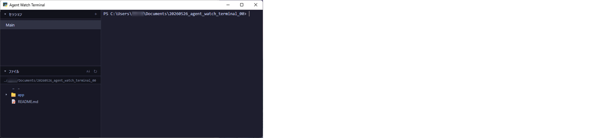
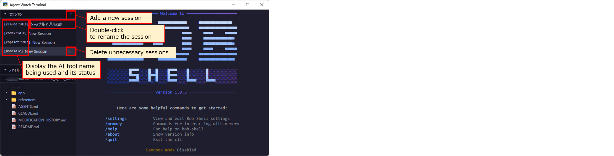
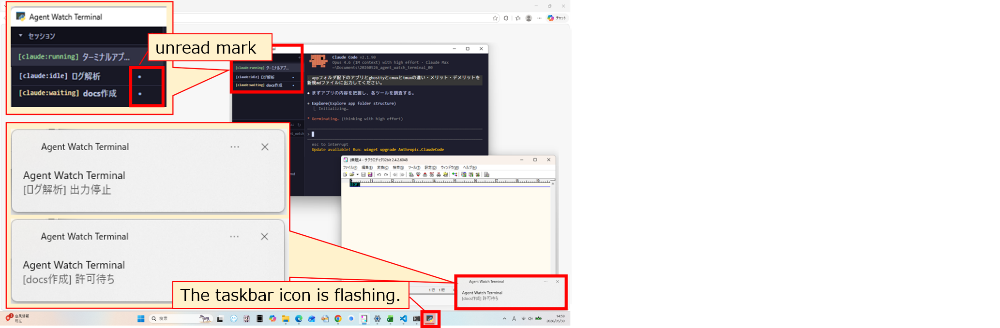
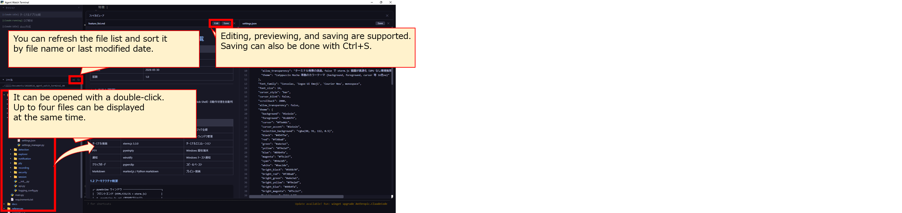

# 1. What is Agent Watch Terminal?
Agent Watch Terminal is a lightweight tool focused on status detection and notifications, designed to reduce the time spent watching AI tool output.
It automatically detects the status of AI tools (Claude Code / Codex CLI / GitHub Copilot CLI / Bob Shell / opencode / opencode2) and notifies you through color indicators and notifications. It is a desktop application for Windows.

# 2. Usage
## Setup
Agent Watch Terminal runs in a venv environment (virtual environment), so Python 3.12 or later must be installed on your PC in advance.
After installing Python, download the files from GitHub, place them in any local directory, and run the following commands to set up:
```bash
cd app
python -m venv .venv
.venv\Scripts\activate
pip install -r requirements.txt
```

## Launch
Use the following command to launch. Depending on your PC's state and settings, it may take about 15 seconds.
If the application does not start properly after 15 seconds, refer to "4. Troubleshooting" and try restarting.
```bash
python main.py
```
If it starts successfully, the following screen will be displayed:


## Mouse operations
While an AI tool is running, mouse input is passed through to the AI tool. Operations therefore follow the same conventions as a regular terminal:

| Operation          | Behavior                                                                            |
| ------------------ | ----------------------------------------------------------------------------------- |
| Wheel              | Scrolls the AI tool's output pane.                                                   |
| **Shift + drag**   | **Selects text. While an AI tool is running, dragging without Shift does not select.** |
| Right click        | Copies the selected text, or pastes the clipboard contents when nothing is selected.  |

In a plain shell with no AI tool running, dragging without Shift also selects text.

# 3. Key Features
Agent Watch Terminal's main features are "automatic detection and status tracking of AI agents" and "management of multiple terminal sessions".
Even when using multiple AI tools in parallel, you can check the status of each session at a glance.
When an agent is detected, the agent name and status are displayed in the session list on the sidebar. There are four types of status:
| Status      | Meaning                                         | Color  |
| ----------- | ----------------------------------------------- | ------ |
| **idle**    | Agent is idle, or has returned to the shell      | Gray   |
| **running** | Agent is executing code generation or processing | Green  |
| **waiting** | Waiting for user permission or input              | Yellow |
| **error**   | An error has occurred                             | Red    |



When an AI tool's status changes to "waiting" or "error", it notifies you via Windows toast notifications and taskbar flashing.
Notifications are suppressed when Agent Watch Terminal is in the foreground.


The sidebar also includes a file explorer.
It is designed primarily for editing code through AI tools rather than manual editing.
Therefore, it does not include features for manual editing convenience, such as syntax highlighting found in VS Code.


Agent Watch Terminal saves session information and terminal display content when the application is closed, and restores them to a state close to the previous session on the next launch.
It also records the session names of AI agents that were active at the time of exit and sends resume commands on the next launch, making it easy to resume from the previous working state.


# 4. Troubleshooting
## 4-1. Application does not start properly after 15 seconds
Close Agent Watch Terminal using the "x" button in the upper right corner or via Task Manager, then restart with `python main.py`.
If restarting does not resolve the issue, delete the session management files and restart the application.
(Deleting these files means that resume commands will not be executed on the next launch.)

## 4-2. File explorer display is cut off
Try clicking the maximize/restore button in the upper right corner of Agent Watch Terminal, or toggling the file explorer panel open and closed.

## 4-3. File explorer does not follow `cd` in WSL
The file explorer is designed to follow the current directory in WSL even when WSL is launched from PowerShell.
However, this may not work in some environments.

- If `PROMPT_COMMAND` is overwritten in `~/.bashrc`
If `PROMPT_COMMAND` is overwritten by assignment in `~/.bashrc`, the mechanism set by Agent Watch Terminal may be disabled.
For example, if it is set as `PROMPT_COMMAND='custom'`,
change it to append to the existing `PROMPT_COMMAND` (`PROMPT_COMMAND="${PROMPT_COMMAND:+$PROMPT_COMMAND;}custom"`) to allow coexistence.
Note that immediately after returning to PowerShell from WSL with `exit`, the file explorer will resync to the PowerShell-side current directory.

- If using a shell other than bash
Currently, the `cd` tracking within WSL assumes bash. Therefore, in environments where the default WSL shell has been changed to zsh or fish, the file explorer may not follow the current directory within WSL.
Support for zsh (`precmd_functions`) and fish (`fish_prompt`) would be needed, but this is not yet implemented in the current version.

# 5. License
This project is licensed under the MIT License.

However, the external tools used by this project, such as "Claude Code", "Codex CLI", "GitHub Copilot CLI", "Bob Shell", "opencode", and "opencode2", are outside the scope of this license. Please follow the terms of use for each tool.


# Appendix. Design Philosophy and Policy
For details, please refer to [this article](https://zenn.dev/stockdatalab/articles/20260531_tech_awt) (in Japanese).

Agent Watch Terminal is not a feature-rich terminal for operating or integrating AI tools, but a lightweight terminal focused on status detection and notifications.
We believe that what is most often wasted when using AI tools is not the operation itself, but the time spent leaving tasks unattended due to not noticing permission requests, input requests, or errors.
Therefore, rather than pane splitting or MCP integration, we prioritize knowing which session requires attention at any given moment.

The status detection of AI agents is based on text clues in terminal output.
To achieve this, we adopt a two-stage gate detection approach: first identifying the type of AI tool, then tracking states such as idle, running, waiting, and error.
To prevent false notifications, we combine debounce processing, ANSI control code handling, lightweight regex-based detection, and notification suppression when in the foreground.
Furthermore, assuming always-on operation, we use pywebview to ensure that the monitoring tool itself remains lightweight.
