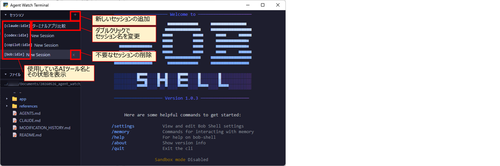
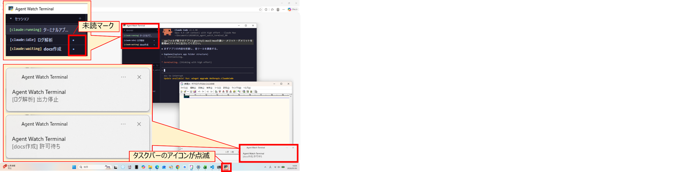
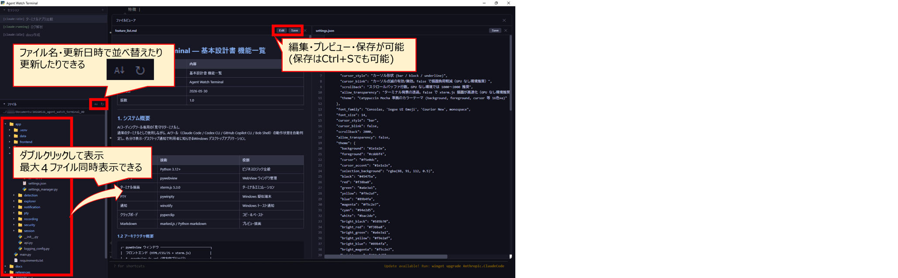

# 1. Agent Watch Terminalとは
Agent Watch Terminalは、AIツールの出力を見張り続ける時間を減らすための、状態検出と通知に特化した軽量ツールです。
AIツール（Claude Code / Codex CLI / GitHub Copilot CLI / Bob Shell / opencode / opencode2）の状態を自動判定し、色と通知で知らせるWindows向けデスクトップアプリケーションです。

# 2. 使用方法
## セットアップ
Agent Watch Terminalはvenv環境（仮想環境）で動作するため、事前にPython 3.12以上をPCにインストールしておく必要があります。
Pythonインストール後、資材をGitHubからダウンロードし、ローカルの任意の場所に配置後、以下のコマンドでセットアップできます。
```bash
cd app
python -m venv .venv
.venv\Scripts\activate
pip install -r requirements.txt
```

## 起動
起動は以下のコマンドです。PCの状態や設定によっては15秒程度かかる場合があります。
15秒以上経っても正常に起動しない場合は、「4. トラブルシュート」を参考にして再起動してみてください。
```bash
python main.py
```
正常に起動すれば、以下のような画面が表示されます。


## マウス操作
AIツールの実行中は、マウス操作がAIツール側へ渡ります。そのため、通常のターミナルと同じく次の操作になります。

| 操作            | 動作                                                     |
| ------------- | ------------------------------------------------------ |
| ホイール          | AIツールの出力欄をスクロールします。                                    |
| **Shift+ドラッグ** | **テキストを選択します。AIツールの実行中は、Shiftを押さない左ドラッグでは選択できません。**<br>Shiftを押している間、マウス操作はAIツールへ渡さず選択専用として扱います。 |
| 右クリック         | 選択中のテキストがあればコピーし、無ければクリップボードの内容を貼り付けます。AIツール側にも右クリックの動作がある場合に二重に実行されないよう、右クリックはAIツールへ渡していません。 |

AIツールを起動していないシェルの状態では、Shiftを押さない左ドラッグでもテキストを選択できます。

## opencode2利用時の注意
opencode2は上部にセッションタブを持ちます。このタブは作業ディレクトリごとに
`~/.local/state/opencode/beta/tui/tabs.json`へ保存されるため、ターミナルを閉じただけではタブが残り、
次回起動時に復活して溜まり続けます。

そのためAgent Watch Terminalは、セッション一覧の「×」を押したときに、
opencode2へタブを閉じるキー（`Ctrl+X`→`W`）を送ってからターミナルを閉じます。
セッション自体は削除されず、閉じられるのはタブだけです。

**この動作は`~/.config/opencode/cli.json`の次の2つの設定に依存します。**

| 設定                   | 既定値         |
| -------------------- | ----------- |
| `leader`             | `ctrl+x`    |
| `session.tab.close`  | `<leader>w` |

**どちらかを変更した場合、タブは閉じられなくなります。**
その場合は`app/source/detection/agent_patterns.py`のopencode2定義にある`close_tab_keys`を、
変更後のキーに合わせて修正してください。

# 3. 主な機能
Agent Watch Terminalの特徴は、「AIエージェントの自動検出と状態追跡をできる点」と「複数のターミナルセッションを管理できる点」です。
複数のAIツールを並行して使う場合でも、各セッションの状態を一覧で確認できます。
エージェントを検出すると、サイドバーのセッション一覧にエージェント名とステータスが表示されます。ステータスは次の4種類です。
| ステータス       | 意味                      | 色   |
| ---------- | ---------------------- | -- |
| **idle**    | エージェントが待機中、またはシェルに戻った状態 | グレー |
| **running** | エージェントがコード生成や処理を実行中     | 緑   |
| **waiting** | ユーザーの許可や入力を待っている状態      | 黄   |
| **error**   | エラーが発生した状態              | 赤   |



AIツールのステータスが「許可待ち」や「エラー」に変わると、Windowsのトースト通知とタスクバー点滅で知らせます。
Agent Watch Terminalがフォアグラウンドの時には通知しない仕様になっています。


また、サイドバーにファイルエクスプローラを搭載しています。
基本的にはコードを人間が直接修正するのではなく、AIツールで編集する使い方を想定しています。
そのため、VS Codeのような変数の色分けなど、手作業で編集しやすくするための機能は備えていません。


Agent Watch Terminalは、アプリを終了してもセッション情報やターミナルの表示内容を保存し、次回起動時に前回の状態に近い形で復元できます。
終了時に動作中だったAIエージェントのセッション名を記録しておき、次回起動時にresumeコマンドを送信できるようにすることで、
前回の作業状態から再開しやすくする機能も備えています。


# 4. トラブルシュート
## 4-1. 15秒以上経っても正常に起動しない場合
Agent Watch Terminalの右上の「×」やタスクマネージャーからAgent Watch Terminalを終了し、再度python main.pyで起動します。
再起動しても正常に起動しない場合は、セッションを管理している以下のファイルを削除して、アプリを再起動してみてください。
（ファイルを削除すると、アプリ起動時にresumeコマンドは実行されません。）

## 4-2. ファイルエクスプローラの表示が見切れる場合
Agent Watch Terminalの右上の「□」（画面の拡大・縮小）を押下したり、ファイルエクスプローラのエリアを開閉したりしてみてください。

## 4-3. WSL内でcdしてもファイルエクスプローラが追従しない場合
PowerShell上でwslを起動した場合でも、WSL内のカレントディレクトリにファイルエクスプローラが追従するようにしています。
ただし、環境によってはこの仕組みが動作しない場合があります。

- `~/.bashrc`で`PROMPT_COMMAND`を上書きしている場合
`~/.bashrc`内で`PROMPT_COMMAND`を代入して上書きしている場合、Agent Watch Terminalが設定した仕組みが無効になることがあります。
たとえば、`PROMPT_COMMAND='custom'`のように設定されている場合は、
既存の`PROMPT_COMMAND`に追記する形（`PROMPT_COMMAND="${PROMPT_COMMAND:+$PROMPT_COMMAND;}custom"`）へ変更すると共存できます。
なお、WSLから`exit`でPowerShellに戻った直後は、ファイルエクスプローラはPowerShell側のカレントディレクトリに再同期されます。

- bash以外のシェルを使っている場合
現時点では、WSL内の`cd`連動はbashを前提としています。そのため、WSLのデフォルトシェルをzshやfishに変更している環境では、
ファイルエクスプローラがWSL内のカレントディレクトリに追従しない場合があります。
zshでは`precmd_functions`、fishでは`fish_prompt`などの仕組みを使った対応が必要になりますが、本バージョンでは未対応です。

# 5. ライセンス
このプロジェクトは MIT License の下で公開されています。

ただし、本プロジェクトが利用する"Claude Code"・"Codex CLI"・"GitHub Copilot CLI"・"Bob Shell"・"opencode"・"opencode2"などの
外部ツールはこのライセンスの範囲外です。各ツールの利用規約に従ってください。


# Appendix. 設計思想と設計方針
※詳細は、[こちら](https://zenn.dev/stockdatalab/articles/20260531_tech_awt)に掲載しております。

Agent Watch Terminalは、AIツールを操作・統合する多機能ターミナルではなく、状態検出と通知に特化した軽量ターミナルです。
AIツール利用時に無駄になりやすいのは、操作そのものよりも、許可待ち・入力待ち・エラーに気づかず放置してしまう時間と考えています。
そのため、ペイン分割やMCP統合よりも、どのセッションに今注意を向けるべきか分かることを重視しています。

AIエージェントの状態判定は、ターミナル出力のテキストを手がかりにしています。
そのために、まずAIツールの種類を識別し、その後に idle、running、waiting、error などの状態を追跡する二段階ゲート検出を採用しています。
また、誤通知を防ぐために、デバウンス処理、ANSI制御コードへの対応、正規表現による軽量な判定、フォアグラウンド時の通知抑制を組み合わせています。
さらに、常時起動を前提として、pywebviewを使い、監視ツール自体が重くならない設計にしています。
